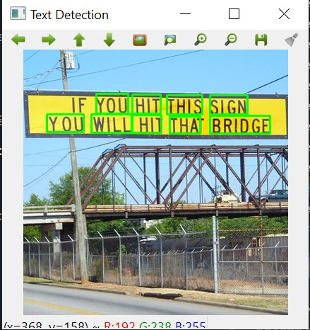
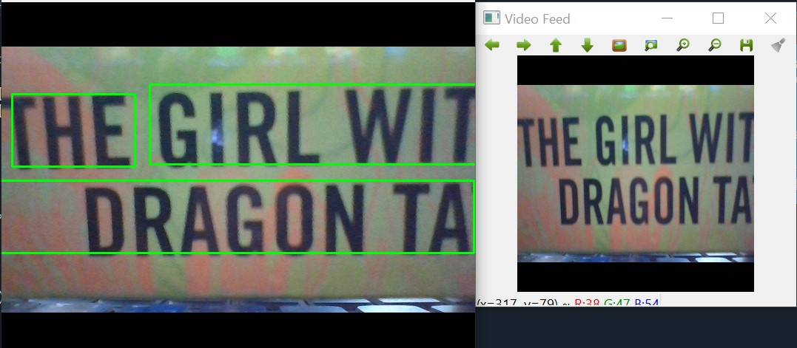
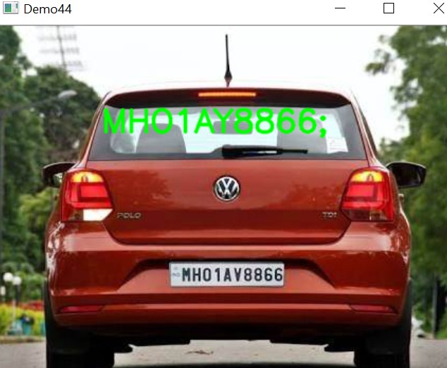

# Optical Character Recognition
Using traditional and deep learning models for text recognition and detection
## Getting Started
Download the repository and use the following to run: 
> Python == 3.7
>
> OpenCV == 4.2.0
>
> ImUtils == 0.5.3
>
> Tesseract == 3.05
>
## Details
| File | Information |
|-------|------------|
| Demo42_OCRTesseract.py  | OCR using tesseract  | 
| Demo43_EASTDetect.py  | Efficient and Accurate Scene Text Detector (EAST) using OpenCV | 
| Demo44_TextDetectAndOCR.py  | Detect and Recognize | 
| Demo45_EASTDetectorLive.py  | EAST detection using live camera feed | 
| Misc  | Folder containing EAST | 
| imgs  | Images for demonstration  | 
| result43.jpg  | Output of demo43 | 
| result45.jpg  | Output of demo45 | 
| result42.jpg  | Output of demo42 | 
## Demo 43

## Demo 45

## Demo 42

